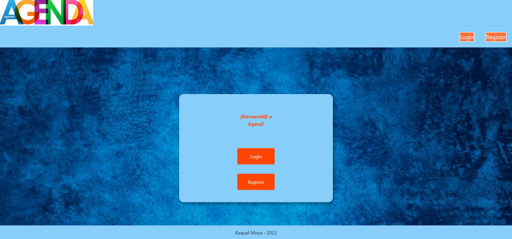
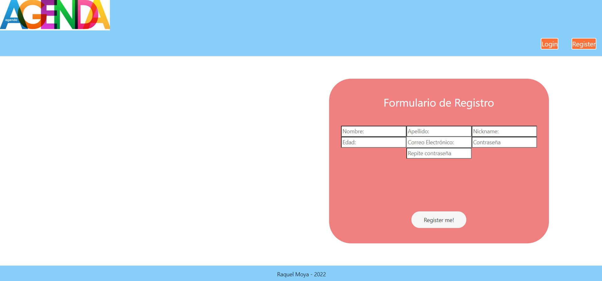
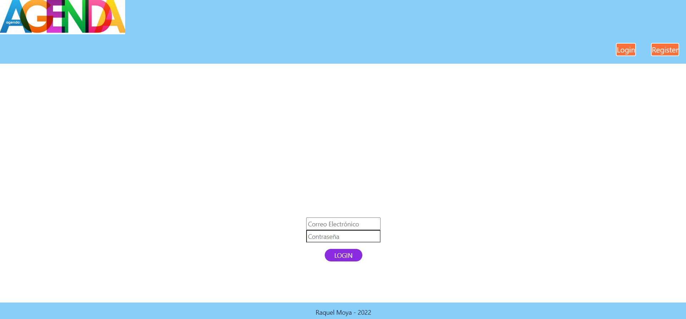
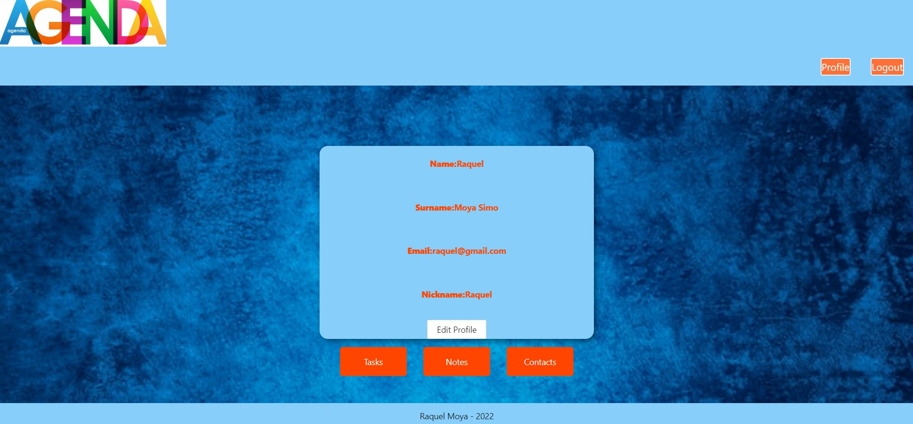
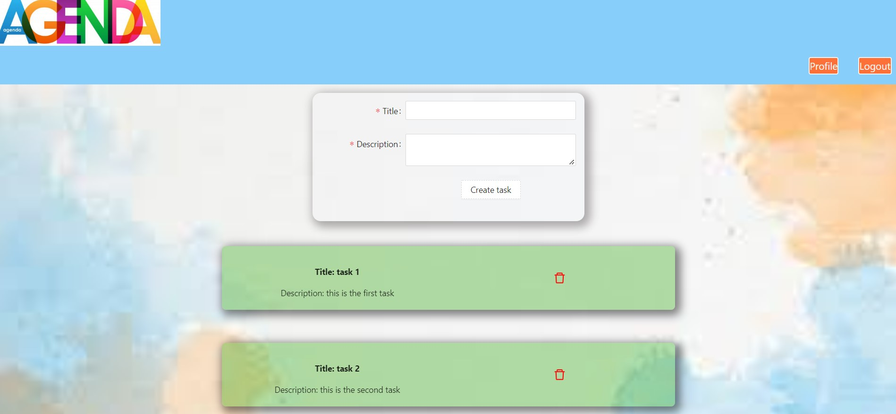
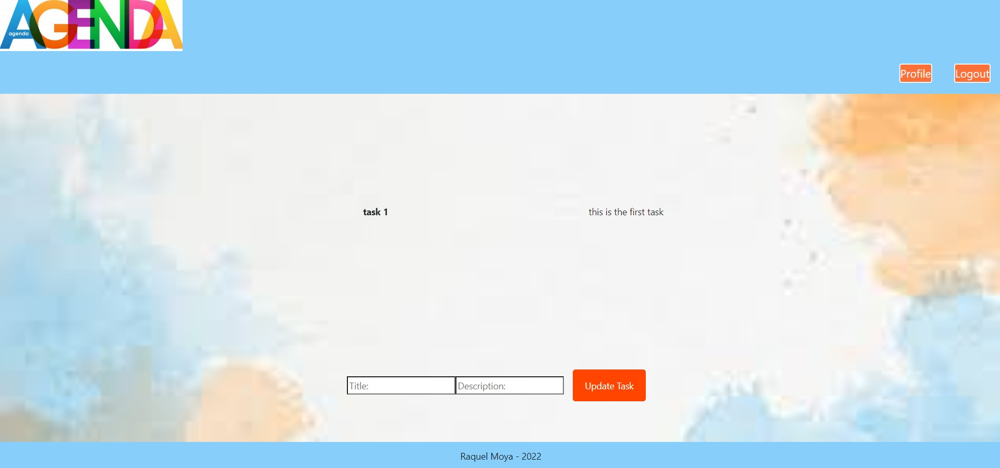

## AGEND FRONTEND 

:wave: Soy Raquel Moya. 

---

- [Sobre el proyecto](#about)   

- [Instrucciones](#instructions)

- [Features](#features)

- [Tecnologías](#tools)

- [Developers](#developers)

---

## Sobre el proyecto

Este proyecto consiste en replicar la parte Frontend de una adenda personal trabajando sobre el Backend que podéis encontrar en el siguiente enlace :
https://github.com/RaquelMoya/agenda

A continuación encontraréis detallados cada una de las funcionalidades de este proyecto.

## Instrucciones 🔧

Dado que hemos deployado el Frontend en AWS, y el backend junto con la BBDD en Heroku, podemos acceder a la app de forma remota con el siguiente enlace:

=============>https://master.d26c8aov44o1cy.amplifyapp.com<===================

Si por el contrario, queremos acceder a la app de manera local, deberíamos seguir las instrucciones de instalación local del backend plasmadas en el readme del proyecto en https://github.com/RaquelMoya/agenda y, posteriormente, clonar este repositorio localmente.
una vez clonado, deberemos instalar las dependencias no incluidas por el archivo .gitignore:

### `npm i`

Posteriormente, deberíamos modificar la raíz existente en cada endpoint en Components y Containers, para trabajar a nivel local. Deberemos modificar todas las raices de los endponts a http://127.0.0.1:8000/ en lugar de https://rocky-retreat-20214.herokuapp.com/

### `npm run dev` ó `npm start`

y ya podríamos acceder a la app sin utilizar el deploy. 

A continuación, detallamos todas las funcionalidades que podemos encontrar en la app.

## Features

Cuando iniciamos la app, nos lleva a la vista Welcome, donde podemos hacer login, o registrarnos. En la barra superior de la pantalla, encontraremos tambien botones de acceso a registro y login.  

Para registrarnos, debemos clickar sobre register y nos redirigirá a la vista de registro, donde podremos introducir nuestros datos para crear un usuario. 

Una vez nos hemos registrado, nos redirigirá a la vista de Login, donde deberemos introducir nuestro email y nuestro password con los que nos hemos registrado previamente. 

Al loguearnos, nos redirigirá a la vista de Profile, donde podremos modificar nuestros datos de usuario o acceder a las diferentes vistas de tareas (tasks), notas (notes) o contactos (contacts). También veremos como en la barra superior aparece un botón cde profile desde el que podremos volver a nuestro perfil y un botón para hacer Logout.

Tanto si clickamos en Tasks, Notes o Contacts, nos redirigirá a dicha vista y nos mostrará todas las entradas que tiene el usuario logueado en su perfil. En cada vista, podremos crear una nueva entrada, o clickar sobre el título o nombre del objeto y acceder a los detalles, donde podremos modificar los campos.

## Tecnologías y dependencias utilizadas

 

## Developers ✍️

[Raquel Moya](https://github.com/RaquelMoya)

Última edición: 11/04/2022